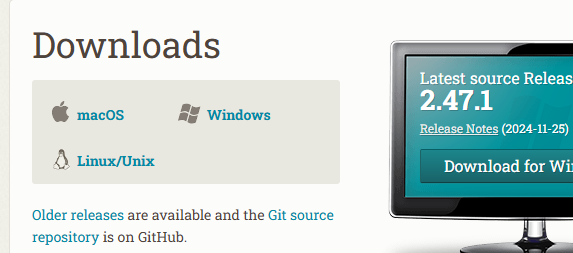
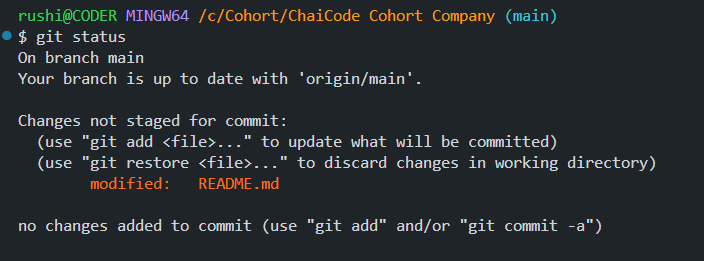
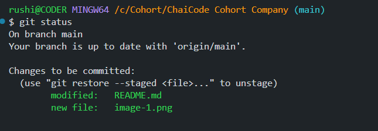
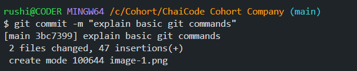
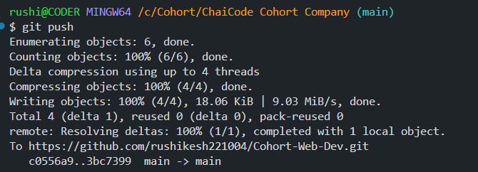
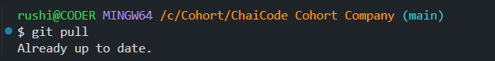
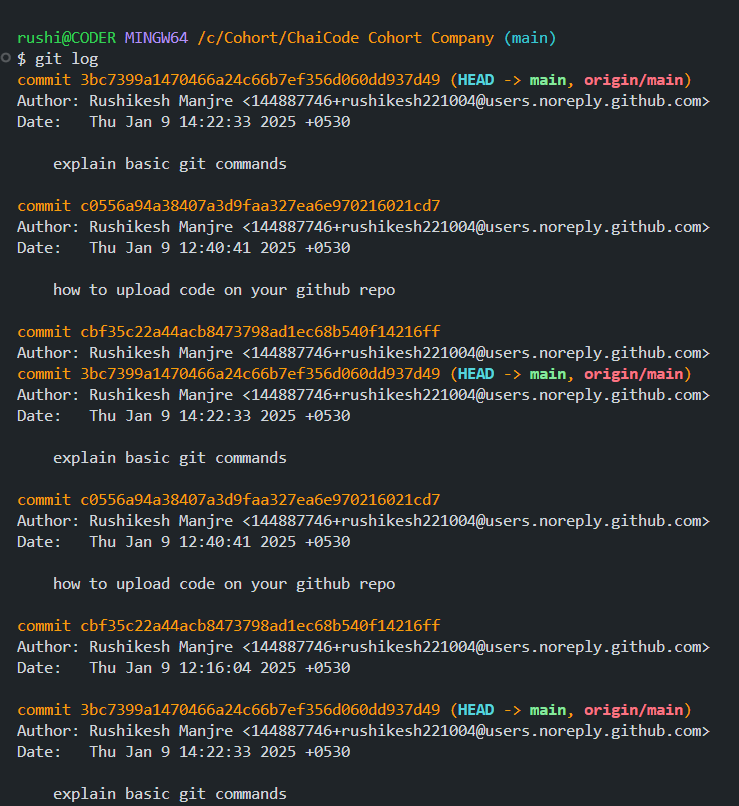

# Welcome to Git and GitHub at ChaiCode Cohort!

Welcome to the ChaiCode Git and GitHub Documentation. This guide is designed to help developers at ChaiCode effectively use Git and GitHub for version control and collaboration. Git, a distributed version control system, empowers developers to track changes, manage codebases, and work on multiple features or bug fixes simultaneously without conflicts. GitHub, a cloud-based platform, complements Git by offering tools for collaboration, project management, and secure code hosting.

Together, Git and GitHub are essential for ensuring seamless teamwork, maintaining code quality, and delivering robust software solutions efficiently. At ChaiCode, adopting these tools helps streamline development workflows, foster collaboration, and achieve excellence in every project.

## Basics of Git and GitHub

**Git**
 - Git is a version control system that helps manage and track code. Developers can easily create branches and work on different features without any conflicts. It enables multiple developers to work efficiently on the same project.

 - Major companies use Git because it keeps the code safe and well-structured. If the system crashes, Git provides a backup, ensuring that the code remains safe and secure.
  
**Github**
 - GitHub is a platform where you can store your code. If your system crashes in the future, your code will remain safe and accessible through repositories on GitHub. Developers from all over the world share and collaborate on their project code on GitHub. It is a place where you can organize your code and ensure that it remains secure and available with a backup.

# How to install Git?

**Step 1 :**
- Go to the google chrome and search "git download". Go to the first link
    

    click the download button as your system requirements(e.g, macOS, Windows, Linux/Unix)

**Step 2 :**
 - After downloading check the git installed or not following command
    ```bash
    git --version
    ```
**Step 3 :**
  - Then configure Git with user name and email
    ```bash
    git config --global user.name "Your Name" git config --global
    ```
    ```bash
    user.email "your.email@example.com"
    ```

# How to create repository on your github account
 - Go to your github account 
 - Then go to the repositories section and click the green color "New button"
 - Enter "Repository name", add "Description" choose public or private(Note: public means your repo see anyone in the world and private means its only show show you)
 - Then click the "Create repository" button
  - So finally your repository created successfully.
  
**How to initialize repository in your project?**
 - first of all initialize the empty repository using following git command
  
    ```bash
    git init
    ```
- then shows you "U" on your files name "U" means untracked file. How to this is tracked? following git command helps to tracked file
  
  ```bash
  git add <-file name->
  ```
  
- Then commit the file using following command
  
  ```bash
  git commit -m "Add Your Commit Message"
  ```

- then connect your local repository to github repository using following command
  
  ```bash
  git remote add origin <-Enter remote repository url->
  ```

- after all push your code on your github repository using following command
  
  ```bash
  git push -u origin main
  ```

- finally your code pushes on your repository you can see the your code on your github repository account


# How to use Git commands and what is the purpose using Git commands

**first command -**
 ```bash
 git status
 ```
 - This command shows the how many files staged or how many files not staged means not added

    - changes not staged -
        

    - changes staged
  


**second command -**
```bash
git add 
```
- This command adds local repository changes in staging area.

**third command -**
```bash
git commit -m "message"
```
- The git commit -m "message" command is used to commit your staged changes, where you provide a message that gets stored with your commit.
  

**fourth command -**
```bash
git push
```
- this command used to push changes on your github repository 
  

**fifth command -**
```bash
git pull
```
- The git pull command is used to keep your local repository up-to-date, meaning it fetches all the latest changes from the remote repository and merges them into your local repository.
  

**sixth command -**
```bash
git log 
```
- The git log command is used to view the commit history of your Git repository. Through this command, you can see what changes were made in each commit, which files were modified, and on which date the commit was made.
    
